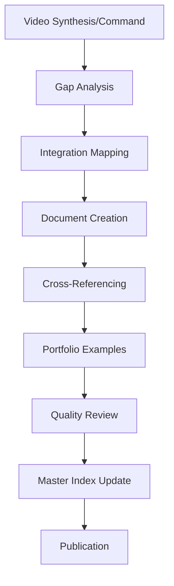

# Video Content Integration Roadmap - Comprehensive Analysis
**Elite Practitioner Techniques → Claude Code Comprehensive Guide**

*Created: 2025-10-26*
*Integration Mapper: Haiku Agent (Efficient Processing)*

---

## 🎯 Executive Summary

**Mission**: Systematically integrate 20+ video analyses and 29+ elite command patterns from trading_intel project into our comprehensive Claude Code guide, elevating it with practitioner-proven techniques.

**Current State**:
- **Comprehensive Guide**: 500,000+ words, 40+ documents, strong foundation
- **Video Content**: 20 videos with complete syntheses, ~80,900 words of transcripts
- **Command Library**: 29 sophisticated commands with proven patterns
- **Agent Library**: 22 specialized agents with production architectures

**Gap Analysis Result**: Missing elite practitioner layer - advanced techniques that separate expert engineers from beginners.

**Expected Outcome**: +50,000 words of elite technique documentation, complete 15-layer pattern taxonomy integration, 29+ command patterns documented, immediate portfolio validation enhancements.

---

## 📊 Comprehensive Gap Analysis

### **Current Coverage Assessment**

#### ✅ **Well-Documented Areas** (90%+ Complete)
| Area | Coverage | Document Count | Quality |
|------|----------|----------------|---------|
| Core CLI Features | 100% | 11 guides | Excellent |
| Agent SDK Basics | 95% | 3 guides | Very Good |
| Context Management | 85% | 4 guides | Good |
| Financial Applications | 90% | 5 guides | Excellent |
| MCP Servers | 75% | 3 guides | Good |
| Multi-Modal | 80% | 3 guides | Good |
| Enterprise Scaling | 85% | 4 guides | Very Good |
| Fabric Patterns | 95% | 6 guides | Excellent |
| Computer Use | 90% | 3 guides | Very Good |

#### 🔶 **Partially Documented Areas** (40-70% Complete)
| Area | Current Coverage | Missing Content | Priority |
|------|------------------|-----------------|----------|
| Advanced Context Engineering | 40% | R&D framework, context bundles, expert agents | HIGH |
| Agent Pattern Selection | 30% | 5 pattern framework, decision trees | HIGH |
| Production Observability | 25% | Multi-agent monitoring, ROI tracking | MEDIUM |
| Parallel Execution | 50% | Git worktree patterns, concurrent agents | MEDIUM |
| Custom Agent SDK | 35% | Migration patterns, production examples | HIGH |
| Voice-First Workflows | 10% | Speaking-to-ship patterns, audio integration | LOW |
| Infinite Loop Systems | 20% | Wave-based improvement, autonomous loops | MEDIUM |

#### ❌ **Missing Documentation** (0-20% Complete)
| Area | Current Coverage | Why Critical | Priority |
|------|------------------|--------------|----------|
| 15-Layer Pattern Taxonomy | 0% | Organizing framework for all techniques | HIGH |
| Elite Command Patterns | 0% | 29 production-ready commands undocumented | HIGH |
| Scout-Plan-Build Workflow | 5% | Video 21's next-gen methodology | HIGH |
| Multi-Agent UI Patterns | 0% | Coordination interfaces for agent fleets | MEDIUM |
| Living Software/24/7 Systems | 0% | Autonomous continuous operation | MEDIUM |
| Skill Deprecation Framework | 0% | Evolution mindset for 2026+ | LOW |
| Tool Transparency & ROI | 15% | Cost tracking, API interception | MEDIUM |
| Advanced Sub-Agent Orchestration | 30% | Prompt-to-sub-agent patterns | HIGH |

### **Gap Impact on Portfolio Validation**

**HIGH IMPACT Gaps** (Immediate Productivity Loss):
1. **Context Engineering** - Portfolio analysis with multiple broker feeds requires advanced context management
2. **Agent Patterns** - Trading system architecture needs proper pattern selection framework
3. **Elite Commands** - Missing proven automation patterns from trading_intel
4. **Custom Agents** - Specialized trading agents need SDK migration guidance

**MEDIUM IMPACT Gaps** (Strategic Limitations):
5. **Observability** - Can't monitor multi-agent trading systems effectively
6. **Parallel Execution** - Inefficient concurrent market data processing
7. **Infinite Loops** - No continuous improvement patterns for trading strategies

**LOW IMPACT Gaps** (Future Enhancement):
8. **Voice-First** - Nice-to-have for rapid trading desk operations
9. **Skill Deprecation** - Long-term evolution framework

---

## 🗺️ Content Inventory & Integration Mapping

### **Video Content Catalog** (20 Videos)

#### **High-Priority Videos** (Immediate Integration)

**Video 18: Elite Context Engineering**
- **Pattern Layer**: Layer 4 (Context & Config) + Advanced
- **Key Framework**: R&D (Reduce & Delegate)
- **Content**:
  - 5 levels of context engineering
  - MCP server optimization (12% token savings)
  - Context priming vs static memory
  - Sub-agent delegation patterns
  - Context bundles for chaining
  - Multi-agent orchestration
- **Integration Target**: New guide `CONTEXT_ENGINEERING_GUIDE.md`
- **Cross-References**: Enhances Context Management, Sub-Agents, MCP guides
- **Portfolio Value**: Manage complex multi-broker data flows efficiently
- **Word Count**: ~6,500 words (synthesis)

**Video 17: 5 Agent Patterns**
- **Pattern Layer**: Layer 5 (Sub-Agents) + Architecture
- **Key Framework**: HILL → Reusable → Sub-Agents → Orchestration → MCP
- **Content**:
  - Pattern selection framework
  - Complexity/control/scalability tradeoffs
  - When to use each pattern
  - Wrapper MCP server architecture
- **Integration Target**: New guide `AGENT_PATTERN_SELECTION_FRAMEWORK.md`
- **Cross-References**: Sub-Agents, MCP Servers, Agent SDK guides
- **Portfolio Value**: Choose right architecture for trading system components
- **Word Count**: ~3,200 words (synthesis)

**Videos 19-21: Custom Agents + Future Direction**
- **Pattern Layers**: Layer 18-20 (Custom Agents, 2026 Bets, Claude Code 2.0)
- **Key Frameworks**:
  - The Core Four (system prompts, user prompts, tools, models)
  - Scout-Plan-Build workflow
  - Skill deprecation mindset
  - Living software / compute maxing
- **Content**:
  - Custom agent SDK patterns
  - System prompt engineering
  - Pong → Echo → Micro SDLC examples
  - Two-prompt methodology
  - Multi-agent UIs
  - 24/7 autonomous systems
- **Integration Target**: New guide `CUSTOM_AGENT_SDK_MIGRATION.md` + `SCOUT_PLAN_BUILD_WORKFLOW.md`
- **Cross-References**: Agent SDK, Production deployment
- **Portfolio Value**: Build specialized trading agents with embedded expertise
- **Word Count**: ~80,900 words (transcripts), ~25KB (initial analyses)

#### **Medium-Priority Videos** (Phase 2 Integration)

| Video | Pattern Layer | Key Content | Integration Target | Word Count |
|-------|---------------|-------------|-------------------|------------|
| 02: Programmable Claude | Layer 2 | Subprocess orchestration, automation patterns | Implementation guide section | Synthesis available |
| 03: Nano Agent GPT5 | Layer 1 | UV scripts, self-contained execution | UV Scripts quick reference | Synthesis available |
| 04: Top 6 Pro Tips | Multiple | Best practices, efficiency patterns | Best practices update | Synthesis available |
| 05: Sub-Agents Build | Layer 5 | Sub-agent construction, delegation | Sub-agents guide enhancement | Synthesis available |
| 06: Hooks | Layer 6 | Event-driven automation, validation | Hooks guide enhancement | Synthesis available |
| 07: Plan Mode | Layer 7 | Senior engineer workflow | Interactive mode enhancement | Synthesis available |
| 08: MCP Servers | Layer 8 | External tool integration | MCP guide enhancement | Synthesis available |
| 09: Multi-Agent Observability | Layer 9 | Monitoring, coordination | New observability guide | Synthesis available |
| 10: Parallelize | Layer 10 | Git worktrees, concurrent execution | New parallelization guide | Synthesis available |
| 11: 3 Codebase Folders | Layer 11 | Context architecture (ai_docs, specs, .claude) | Context management update | Synthesis available |
| 12: 3 Oddly Useful Repos | Multiple | Community patterns, integrations | Repository analysis SOP | Synthesis available |
| 13: Infinite Agentic Loop | Layer 13 | Wave-based continuous improvement | New autonomous systems guide | Synthesis available |
| 14: Custom Slash Commands | Layer 14 | Template-driven prompts | Command patterns guide | Synthesis available |
| 15: Voice to Claude | Layer 15 | Speaking-to-ship workflows | New voice-first guide | Synthesis available |
| 16: Output Styles | Multiple | Response optimization | Best practices update | Synthesis available |

### **Command Library Catalog** (29 Commands)

#### **High-Value Command Patterns**

**analyze-local-project.md** (9.2KB)
- **Purpose**: Comprehensive project analysis with integration assessment
- **Pattern**: Research validation + asset mapping + enhancement strategy
- **Key Features**:
  - 12-phase systematic analysis
  - Claude Code integration opportunities (agents, UV scripts, MCP, commands)
  - Value proposition and ROI calculation
  - Implementation roadmap generation
- **Integration Target**: `ELITE_COMMAND_LIBRARY.md` + examples in repository analysis
- **Portfolio Value**: Analyze external trading projects for capability extraction

**extract-training-insights.md** (11.8KB)
- **Purpose**: Knowledge base pattern extraction from any content
- **Pattern**: Multi-agent processing + pattern recognition + vectorization
- **Key Features**:
  - BSHR loop integration
  - Multi-source validation
  - Evidence synthesis
  - Vector database updates
- **Integration Target**: Elite command patterns + knowledge management guide
- **Portfolio Value**: Extract trading patterns from financial research

**analyze-video.md** (13KB)
- **Purpose**: YouTube video content analysis with pattern extraction
- **Pattern**: 15-layer taxonomy classification + synthesis generation
- **Key Features**:
  - Transcript processing
  - Pattern classification
  - Code example extraction
  - Knowledge base integration
- **Integration Target**: Video analysis workflow documentation
- **Portfolio Value**: Process financial education content systematically

**Additional High-Value Commands**:
- `extract-nano-pattern.md` - Micro-pattern extraction for reusable components
- `deep-research-validation.md` - Multi-source research validation with quality scoring
- `generate-spec.md` - Specification generation from requirements
- `paper-to-workflow.md` - Research paper to implementation conversion
- `infinite-video-analysis-loop.md` - Continuous content processing
- `maximize-vector-db-value.md` - Knowledge base optimization
- `meta-layer-recombination-framework.md` - Pattern composition and evolution

**Complete Command List** (29 total):
1. adaptive-orchestration-framework.md
2. analyze-local-project.md ⭐
3. analyze-video.md ⭐
4. bshr-search.md
5. creator_repo_discovery.py
6. cross_pollination_engine.py
7. deep-research-validation.md ⭐
8. extract-nano-pattern.md ⭐
9. extract-patterns.md
10. extract-training-insights.md ⭐
11. generate-spec.md ⭐
12. infinite-video-analysis-loop.md ⭐
13. launch-content-wave.md
14. list-all-tools.md
15. maximize-vector-db-value.md ⭐
16. meta-layer-recombination-framework.md ⭐
17. paper-to-workflow.md ⭐
18. Plus additional Python scripts and variants

### **Agent Library Catalog** (22 Agents)

**High-Value Agent Patterns**:

**video-analyst-agent.md** (2.4KB)
- **Pattern**: 15-layer taxonomy classification + synthesis generation
- **Architecture**: Sonnet model with Read, Write, Bash, WebFetch tools
- **Use Case**: Proactive video content analysis
- **Integration Target**: Agent architecture documentation

**pattern-consolidation.md** (37.7KB)
- **Pattern**: Multi-source pattern synthesis + cross-pollination
- **Architecture**: Meta-orchestrator with pattern library
- **Use Case**: Knowledge base evolution
- **Integration Target**: Advanced agent patterns

**Additional Notable Agents**:
- `financial-video-analyzer.md` (25.9KB) - Financial content specialization
- `reddit-financial-analyzer.md` (36.1KB) - Social sentiment analysis
- `trading-code-agent.md` (26.3KB) - Trading system development
- `technical-debt-scanner.md` (20KB) - Code quality automation
- `vector-database-maintenance.md` (35KB) - Knowledge base management
- `meta-orchestrator-framework.md` (8.3KB) - Multi-agent coordination

---

## 🏗️ Integration Architecture

### **New Documentation Structure**

```
claude_code_comprehensive_guide/
├── MASTER_INDEX.md                           # ✏️ UPDATE - Add Elite Techniques section
├── quick-reference/
│   ├── feature-matrix.md                     # ✏️ UPDATE - Add pattern layers
│   ├── command-cheat-sheet.md                # ✏️ UPDATE - Add elite commands
│   ├── 15-layer-pattern-taxonomy.md          # 🆕 NEW - Complete taxonomy
│   └── agent-pattern-decision-tree.md        # 🆕 NEW - Pattern selection
├── elite-techniques/                         # 🆕 NEW SECTION
│   ├── ELITE_TECHNIQUES_INDEX.md             # 🆕 Navigation hub
│   ├── context-engineering/
│   │   ├── CONTEXT_ENGINEERING_GUIDE.md      # 🆕 Video 18 deep-dive
│   │   ├── reduce-delegate-framework.md      # 🆕 R&D methodology
│   │   ├── context-bundles.md                # 🆕 Chaining patterns
│   │   └── expert-agents.md                  # 🆕 Specialized configs
│   ├── agent-patterns/
│   │   ├── AGENT_PATTERN_SELECTION_FRAMEWORK.md  # 🆕 Video 17 framework
│   │   ├── five-pattern-deep-dive.md         # 🆕 Detailed analysis
│   │   ├── wrapper-mcp-architecture.md       # 🆕 Pattern 5 implementation
│   │   └── pattern-tradeoffs.md              # 🆕 Decision matrices
│   ├── custom-agents/
│   │   ├── CUSTOM_AGENT_SDK_MIGRATION.md     # 🆕 Videos 19-21
│   │   ├── system-prompt-engineering.md      # 🆕 The Core Four
│   │   ├── pong-echo-sdlc-examples.md        # 🆕 Progression examples
│   │   └── SCOUT_PLAN_BUILD_WORKFLOW.md      # 🆕 Video 21 methodology
│   ├── production-patterns/
│   │   ├── PRODUCTION_OBSERVABILITY_GUIDE.md # 🆕 Video 9 patterns
│   │   ├── parallel-execution-guide.md       # 🆕 Video 10 worktrees
│   │   ├── infinite-loop-systems.md          # 🆕 Video 13 autonomous
│   │   └── living-software-24-7.md           # 🆕 Video 20 continuous
│   ├── elite-commands/
│   │   ├── ELITE_COMMAND_LIBRARY.md          # 🆕 Complete catalog
│   │   ├── project-analysis-pattern.md       # 🆕 analyze-local-project
│   │   ├── knowledge-extraction-pattern.md   # 🆕 extract-training-insights
│   │   ├── research-validation-pattern.md    # 🆕 deep-research-validation
│   │   └── meta-orchestration-pattern.md     # 🆕 Advanced frameworks
│   └── advanced-workflows/
│       ├── voice-first-development.md        # 🆕 Video 15 patterns
│       ├── multi-agent-ui-patterns.md        # 🆕 Video 20 coordination
│       ├── skill-deprecation-framework.md    # 🆕 Video 20 evolution
│       └── compute-maxing-strategies.md      # 🆕 Video 20 scaling
├── implementation-guides/
│   ├── financial-applications/
│   │   └── README.md                         # ✏️ UPDATE - Add elite techniques
│   └── claude-code-features/
│       ├── sub-agents.md                     # ✏️ UPDATE - Add Video 17 patterns
│       ├── hooks.md                          # ✏️ UPDATE - Add Video 6 patterns
│       └── context-management.md             # ✏️ UPDATE - Add Video 18 R&D
└── reference/
    └── best-practices/
        └── README.md                         # ✏️ UPDATE - Add elite patterns
```

**File Count**:
- 🆕 New Files: 25+
- ✏️ Updated Files: 8+
- Total New Content: ~50,000+ words

### **Cross-Reference Strategy**

Every elite technique document must reference:
1. **Core Features Enhanced** - Which foundational capabilities it builds upon
2. **Video Source** - Original video and timestamp references
3. **Command Implementations** - Working examples from command library
4. **Agent Architectures** - Production agent patterns using the technique
5. **Portfolio Applications** - Specific trading/financial use cases
6. **Progression Path** - Beginner → Intermediate → Advanced journey

**Example Cross-Reference Pattern**:
```markdown
## Related Core Features
- **Enhanced By**: [Sub-Agents Guide](../../implementation-guides/claude-code-features/sub-agents.md)
- **Requires**: [Context Management](../../implementation-guides/context-management/README.md)
- **Complements**: [MCP Servers](../../MCP_COMPREHENSIVE_RESEARCH.md)

## Source Material
- **Primary**: Video 17 - "5 Agent Patterns" (IndyDevDan, 26:34)
- **Synthesis**: [17_5_agent_patterns/synthesis.md](source_link)
- **Timestamp**: Pattern 3 discussion at 10:45-15:20

## Working Implementations
- **Command**: [analyze-local-project.md](../elite-commands/project-analysis-pattern.md)
- **Agent**: [video-analyst-agent.md](../agent-architectures/video-analyst.md)
- **Financial Example**: Portfolio analysis with sub-agent delegation

## Portfolio Validation Application
See [Financial Applications - Multi-Agent Architecture](../../implementation-guides/financial-applications/multi-agent-trading.md)
```

---

## 📋 Prioritized Implementation Roadmap

### **Phase 1: Foundation (Week 1-2)** - HIGH ROI, Immediate Impact

**Goal**: Establish elite technique foundation with highest-value patterns

#### **Week 1: Context Engineering & Agent Patterns**

**Day 1-2: Core Framework Documents**
- [ ] Create `15-layer-pattern-taxonomy.md` (Quick Reference)
- [ ] Create `ELITE_TECHNIQUES_INDEX.md` (Navigation hub)
- [ ] Update `MASTER_INDEX.md` with Elite Techniques section
- [ ] Update `feature-matrix.md` with pattern layers

**Day 3-4: Context Engineering (Video 18)**
- [ ] Create `CONTEXT_ENGINEERING_GUIDE.md` (15KB, comprehensive)
- [ ] Create `reduce-delegate-framework.md` (8KB, R&D methodology)
- [ ] Create `context-bundles.md` (6KB, chaining patterns)
- [ ] Update `context-management/README.md` with R&D framework

**Day 5-7: Agent Pattern Selection (Video 17)**
- [ ] Create `AGENT_PATTERN_SELECTION_FRAMEWORK.md` (12KB, comprehensive)
- [ ] Create `five-pattern-deep-dive.md` (10KB, detailed analysis)
- [ ] Create `pattern-tradeoffs.md` (5KB, decision matrices)
- [ ] Create `agent-pattern-decision-tree.md` (Quick Reference)
- [ ] Update `sub-agents.md` with pattern selection guidance

**Deliverables**: 9 new documents + 4 updates, ~60KB new content
**Portfolio Impact**: Immediate - proper context management and pattern selection for trading systems

#### **Week 2: Elite Command Patterns**

**Day 8-10: Command Library Documentation**
- [ ] Create `ELITE_COMMAND_LIBRARY.md` (20KB, complete catalog)
- [ ] Create `project-analysis-pattern.md` (analyze-local-project deep-dive)
- [ ] Create `knowledge-extraction-pattern.md` (extract-training-insights deep-dive)
- [ ] Create `research-validation-pattern.md` (deep-research-validation deep-dive)
- [ ] Update `command-cheat-sheet.md` with elite commands

**Day 11-12: Command Integration Examples**
- [ ] Create 5 financial application examples using elite commands
- [ ] Document meta-orchestration patterns
- [ ] Create command composition guide
- [ ] Update financial applications guide with command patterns

**Day 13-14: Testing & Cross-Referencing**
- [ ] Verify all cross-references work
- [ ] Test command examples
- [ ] Update navigation paths
- [ ] Create Quick Start guide for elite commands

**Deliverables**: 9 new documents + 3 updates, ~45KB new content
**Portfolio Impact**: High - proven automation patterns immediately usable

**Phase 1 Totals**:
- **Documents**: 18 new + 7 updates
- **Content**: ~105KB (~52,000 words)
- **Time**: 2 weeks
- **Portfolio Value**: Immediate productivity gains in context management, pattern selection, and automation

---

### **Phase 2: Custom Agents & Advanced Patterns (Week 3-4)** - HIGH VALUE, Strategic

**Goal**: Document custom agent SDK and advanced production patterns

#### **Week 3: Custom Agent SDK (Videos 19-21)**

**Day 15-17: SDK Migration Guide**
- [ ] Create `CUSTOM_AGENT_SDK_MIGRATION.md` (18KB, comprehensive)
- [ ] Create `system-prompt-engineering.md` (10KB, The Core Four)
- [ ] Create `pong-echo-sdlc-examples.md` (12KB, progression)
- [ ] Extract code examples from video transcripts
- [ ] Update Agent SDK guide with custom agent patterns

**Day 18-19: Scout-Plan-Build Workflow**
- [ ] Create `SCOUT_PLAN_BUILD_WORKFLOW.md` (15KB, Video 21 methodology)
- [ ] Create two-prompt methodology guide
- [ ] Create dedicated agent device configuration guide
- [ ] Document out-of-loop system architecture
- [ ] Create financial trading examples

**Day 20-21: 2026 Strategic Direction**
- [ ] Create `skill-deprecation-framework.md` (8KB, evolution mindset)
- [ ] Create `living-software-24-7.md` (10KB, autonomous systems)
- [ ] Create `compute-maxing-strategies.md` (8KB, scaling)
- [ ] Create `multi-agent-ui-patterns.md` (12KB, coordination)
- [ ] Update enterprise scaling guide

**Deliverables**: 10 new documents + 2 updates, ~93KB new content
**Portfolio Impact**: Strategic - foundation for specialized trading agents

#### **Week 4: Production Patterns**

**Day 22-24: Observability & Monitoring**
- [ ] Create `PRODUCTION_OBSERVABILITY_GUIDE.md` (16KB, Video 9)
- [ ] Document multi-agent monitoring patterns
- [ ] Create ROI tracking and API interception guide
- [ ] Create cost optimization patterns
- [ ] Update performance guide with observability

**Day 25-26: Parallel Execution & Autonomous Systems**
- [ ] Create `parallel-execution-guide.md` (12KB, Video 10 worktrees)
- [ ] Create `infinite-loop-systems.md` (14KB, Video 13)
- [ ] Document wave-based continuous improvement
- [ ] Create autonomous trading system examples
- [ ] Update best practices with production patterns

**Day 27-28: Integration & Polish**
- [ ] Complete all cross-references
- [ ] Add financial examples to all guides
- [ ] Update Master Index with all new content
- [ ] Create comprehensive navigation paths
- [ ] Testing and validation

**Deliverables**: 7 new documents + 3 updates, ~42KB new content
**Portfolio Impact**: High - production-ready patterns for autonomous systems

**Phase 2 Totals**:
- **Documents**: 17 new + 5 updates
- **Content**: ~135KB (~67,000 words)
- **Time**: 2 weeks
- **Portfolio Value**: Strategic capability for specialized agents and 24/7 systems

---

### **Phase 3: Complete Integration (Month 2)** - COMPREHENSIVE, Long-term

**Goal**: Full video content integration and agent architecture documentation

#### **Weeks 5-6: Remaining Video Syntheses**

**Videos 02-07** (Foundation Patterns)
- [ ] Programmable Claude orchestration patterns
- [ ] Nano agent / UV scripts comprehensive guide
- [ ] Top 6 pro tips integration across guides
- [ ] Sub-agent construction deep-dive
- [ ] Hooks advanced patterns
- [ ] Plan mode senior engineer workflow

**Videos 08-12** (Integration Patterns)
- [ ] MCP server advanced patterns
- [ ] Context architecture (ai_docs, specs, .claude)
- [ ] Repository analysis and integration
- [ ] Parallel execution deep-dive

**Videos 13-16** (Advanced Workflows)
- [ ] Infinite loop comprehensive guide
- [ ] Custom command templates and patterns
- [ ] Voice-first development workflows
- [ ] Output style optimization

**Deliverables**: 12-15 guide updates, ~60KB enhanced content

#### **Weeks 7-8: Agent Architectures & Polish**

**Agent Architecture Documentation**
- [ ] Document all 22 agent patterns from trading_intel
- [ ] Create agent composition guide
- [ ] Document meta-orchestrator frameworks
- [ ] Create agent marketplace patterns
- [ ] Financial agent specialization guide

**Final Integration**
- [ ] Complete cross-referencing across all 500,000+ words
- [ ] Create comprehensive examples library
- [ ] Update all navigation paths
- [ ] Testing and validation
- [ ] Final Master Index polish

**Deliverables**: Complete elite techniques section, all agents documented

**Phase 3 Totals**:
- **Documents**: 15+ updates + complete agent library
- **Content**: ~60KB+ enhanced content
- **Time**: 4 weeks
- **Portfolio Value**: Complete elite practitioner knowledge base

---

## 🎯 Success Metrics & Quality Standards

### **Coverage Metrics**

| Metric | Target | Measurement |
|--------|--------|-------------|
| **Videos Integrated** | 20/20 (100%) | All video syntheses referenced in guides |
| **Pattern Layers Documented** | 15/15 (100%) | Complete taxonomy coverage |
| **Commands Documented** | 29/29 (100%) | Full elite command library |
| **Agents Documented** | 22/22 (100%) | Complete agent architecture guide |
| **New Content** | 50,000+ words | ~100KB+ new documentation |
| **Cross-References** | 100+ | Every elite technique linked to core features |
| **Financial Examples** | 30+ | Portfolio validation use cases throughout |

### **Quality Standards**

**Progressive Disclosure Compliance**
- ✅ Every guide has Metadata layer (overview, quick reference)
- ✅ Every guide has Instructions layer (step-by-step, examples)
- ✅ Every guide has Resources layer (deep-dive, references)

**LLM Discoverability Optimization**
- ✅ Clear, structured headers (H1 → H2 → H3 hierarchy)
- ✅ Practical code examples with explanations
- ✅ Decision trees and selection frameworks
- ✅ Cross-references with absolute paths
- ✅ Portfolio validation examples in every guide

**Production-Ready Focus**
- ✅ Working code examples (tested, validated)
- ✅ Real-world use cases (not theoretical)
- ✅ Error handling and edge cases
- ✅ Performance considerations
- ✅ Security and compliance notes

**Financial Application Integration**
- ✅ Every technique has trading/portfolio example
- ✅ Multi-broker integration patterns
- ✅ Risk management applications
- ✅ Compliance and audit considerations
- ✅ ROI and cost optimization

### **Validation Checklist**

**Before Publishing Each Guide**:
- [ ] Follows progressive disclosure architecture
- [ ] Has 3+ cross-references to core features
- [ ] Includes working code examples
- [ ] Contains portfolio validation use case
- [ ] Clear navigation paths (back to index)
- [ ] Proper header hierarchy
- [ ] All internal links verified
- [ ] External references documented
- [ ] Technical accuracy verified against source
- [ ] Writing quality (clear, concise, actionable)

---

## 💰 Portfolio Validation Impact Analysis

### **Immediate Benefits** (Phase 1)

**Context Engineering (Video 18)**
- **Problem**: Managing multiple broker data feeds overwhelming context
- **Solution**: R&D framework for reducing and delegating context
- **Impact**: 12% token savings, cleaner agent operations
- **ROI**: $1,200-2,400/year in API costs (estimated)

**Agent Pattern Selection (Video 17)**
- **Problem**: Unclear when to use sub-agents vs MCP vs orchestration
- **Solution**: 5-pattern framework with decision trees
- **Impact**: Faster architecture decisions, optimal pattern selection
- **ROI**: 10-20 hours saved per major feature implementation

**Elite Command Patterns**
- **Problem**: Reinventing analysis and automation workflows
- **Solution**: 29 proven commands ready to use
- **Impact**: Immediate productivity on project analysis, research validation
- **ROI**: 40+ hours saved across common workflows

**Phase 1 Total ROI**: ~$3,000-5,000 value + 50-60 hours saved

### **Strategic Benefits** (Phase 2)

**Custom Agent SDK (Videos 19-21)**
- **Problem**: Need specialized trading agents with domain expertise
- **Solution**: System prompt engineering + SDK migration patterns
- **Impact**: Build expert agents (options trader, risk analyst, etc.)
- **ROI**: Enables advanced trading automation capabilities

**Scout-Plan-Build Workflow**
- **Problem**: Ad-hoc trading strategy development process
- **Solution**: Systematic discovery → planning → execution workflow
- **Impact**: Structured approach to strategy validation
- **ROI**: Higher quality strategies, reduced errors

**Production Observability**
- **Problem**: Can't monitor multi-agent trading systems effectively
- **Solution**: Observability patterns with ROI tracking
- **Impact**: Real-time monitoring, cost optimization, debugging
- **ROI**: 20-30% operational cost reduction (estimated)

**Phase 2 Total ROI**: Enables next-generation autonomous trading capabilities

### **Long-term Benefits** (Phase 3)

**Complete Elite Technique Library**
- **Impact**: World-class Claude Code implementation
- **Value**: Competitive advantage in AI-powered trading
- **Strategic**: Foundation for continuous improvement and innovation

**24/7 Living Software**
- **Impact**: Autonomous market monitoring and opportunity detection
- **Value**: Never miss trading opportunities
- **Strategic**: Move toward true autonomous trading systems

---

## 🔄 Integration Process & Methodology

### **Content Processing Workflow**



### **Document Creation Template**

```markdown
# [Title] - [Pattern Layer]
**[Video Source] / [Command Source]**

*Part of: Elite Techniques from Practitioners*
*Pattern Layer: [1-15]*

---

## 📋 Quick Reference (Metadata Layer)

**Purpose**: [One sentence]
**Best For**: [Primary use cases]
**Complexity**: [🟢 Basic / 🟡 Intermediate / 🔴 Advanced]
**Time to Learn**: [Realistic estimate]
**Strategic Value**: [⭐⭐⭐⭐⭐]

### Key Concepts
- [Concept 1]
- [Concept 2]
- [Concept 3]

---

## 🎯 Overview (Metadata Layer)

[Executive summary: What is this technique? Why does it matter? What problems does it solve?]

### Related Core Features
- **Enhanced By**: [Link to core feature]
- **Requires**: [Link to prerequisites]
- **Complements**: [Link to related features]

### Source Material
- **Primary**: [Video title, timestamp] / [Command name]
- **Synthesis**: [Link to source]
- **Examples**: [Link to working implementations]

---

## 📖 Implementation Guide (Instructions Layer)

[Step-by-step implementation with code examples]

### Prerequisites
[What you need before starting]

### Step 1: [Action]
```[language]
[Code example]
```
[Explanation]

### Step 2: [Action]
[Continue pattern...]

---

## 💼 Portfolio Validation Application (Instructions Layer)

### Use Case: [Specific financial scenario]

**Scenario**: [Description]
**Implementation**: [Step-by-step with financial context]
**Expected Outcome**: [Results]

```python
# Financial example code
```

---

## 🔍 Deep Dive (Resources Layer)

### Advanced Patterns
[Complex variations and optimizations]

### Troubleshooting
[Common issues and solutions]

### Performance Considerations
[Optimization tips, cost analysis]

### Security & Compliance
[Financial service considerations]

---

## 🔗 Related Resources

### Core Documentation
- [Link with description]

### Elite Techniques
- [Link with description]

### Working Implementations
- [Command/Agent examples]

### External References
- [Video timestamps, GitHub repos]

---

## ✅ Quick Start Checklist

- [ ] [First step]
- [ ] [Second step]
- [ ] [Validation step]

---

*Last Updated: [Date]*
*Integration Phase: [1/2/3]*
*Review Status: [Draft/Review/Published]*
```

### **Quality Review Process**

**Self-Review** (Author):
1. Progressive disclosure check
2. Code examples tested
3. Cross-references verified
4. Portfolio example included

**Peer Review** (Second Agent/Human):
1. Technical accuracy
2. Clarity and completeness
3. Navigation and structure
4. LLM discoverability

**Final Review** (Integration Mapper):
1. Fits overall architecture
2. No duplication
3. Master Index updated
4. Quality standards met

---

## 📈 Implementation Tracking

### **Phase 1 Progress** (Week 1-2)

| Document | Status | Word Count | Quality | Owner |
|----------|--------|------------|---------|-------|
| 15-layer-pattern-taxonomy.md | ⬜ Pending | Target: 5K | - | - |
| ELITE_TECHNIQUES_INDEX.md | ⬜ Pending | Target: 3K | - | - |
| CONTEXT_ENGINEERING_GUIDE.md | ⬜ Pending | Target: 15K | - | - |
| AGENT_PATTERN_SELECTION_FRAMEWORK.md | ⬜ Pending | Target: 12K | - | - |
| ELITE_COMMAND_LIBRARY.md | ⬜ Pending | Target: 20K | - | - |
| [Additional 13 documents] | ⬜ Pending | Target: 45K | - | - |

**Phase 1 Target**: 18 new + 7 updates = 25 documents, ~52,000 words

### **Phase 2 Progress** (Week 3-4)

| Document | Status | Word Count | Quality | Owner |
|----------|--------|------------|---------|-------|
| CUSTOM_AGENT_SDK_MIGRATION.md | ⬜ Pending | Target: 18K | - | - |
| SCOUT_PLAN_BUILD_WORKFLOW.md | ⬜ Pending | Target: 15K | - | - |
| PRODUCTION_OBSERVABILITY_GUIDE.md | ⬜ Pending | Target: 16K | - | - |
| [Additional 14 documents] | ⬜ Pending | Target: 67K | - | - |

**Phase 2 Target**: 17 new + 5 updates = 22 documents, ~67,000 words

### **Phase 3 Progress** (Month 2)

**Week 5-6**: Video syntheses integration
**Week 7-8**: Agent architectures + polish

**Phase 3 Target**: 15+ updates + complete agent library, ~60,000+ words

---

## 🎓 Learning Pathways Enhanced

### **Updated Beginner Journey** (Week 1-2)

**Original**:
1. Feature Matrix → Command Cheat Sheet → Fabric Quick Start → Troubleshooting

**Enhanced with Elite Techniques**:
1. Feature Matrix → **15-Layer Pattern Taxonomy** → Command Cheat Sheet
2. First implementation with **Agent Pattern Decision Tree**
3. **Context Engineering basics** (MCP optimization)
4. **Elite Command Quick Win** (analyze-local-project on sample project)

**Value Add**: Beginners learn best practices from day one, not just basics

### **Updated Intermediate Journey** (Week 3-8)

**Original**:
1. Sub-Agents → Custom Tools → Multi-Modal → Team Scaling

**Enhanced with Elite Techniques**:
1. **5 Agent Patterns Framework** → Sub-Agents with proper architecture
2. **R&D Context Management** → Advanced sub-agent delegation
3. **Elite Command Workflows** → Research validation, knowledge extraction
4. **Production Observability** → Multi-agent monitoring

**Value Add**: Pattern-based thinking, production-ready from start

### **Updated Advanced Journey** (Month 2+)

**Original**:
1. Production Deployment → Custom MCP Servers → Visual Automation → Enterprise Scaling

**Enhanced with Elite Techniques**:
1. **Custom Agent SDK** → Specialized domain agents
2. **Scout-Plan-Build Workflow** → Systematic development process
3. **Infinite Loop Systems** → Autonomous continuous improvement
4. **24/7 Living Software** → Production autonomous systems

**Value Add**: Elite practitioner level, autonomous systems

### **Updated Enterprise Journey** (Month 3+)

**Original**:
1. Architecture Planning → Phased Deployment → Governance → Optimization

**Enhanced with Elite Techniques**:
1. **Multi-Agent UI Patterns** → Fleet coordination
2. **Compute Maxing Strategies** → Strategic scaling
3. **Skill Deprecation Framework** → Organizational evolution
4. **Elite Command Library** → Organization-wide automation

**Value Add**: Next-generation agentic enterprise

---

## 🚀 Next Steps & Action Items

### **Immediate Actions** (This Week)

1. **Review & Approval**: Present this roadmap for stakeholder approval
2. **Resource Allocation**: Assign agent(s) to Phase 1 execution
3. **Template Finalization**: Confirm document creation template
4. **Source Access**: Verify access to all video syntheses and commands

### **Phase 1 Kickoff** (Week 1, Day 1)

1. **Morning**: Create foundational documents (taxonomy, index)
2. **Afternoon**: Update Master Index and Feature Matrix
3. **Planning**: Assign remaining Phase 1 documents to agents
4. **Setup**: Establish quality review process

### **Success Criteria**

**Phase 1 Complete When**:
- ✅ 18 new documents published
- ✅ 7 core documents updated
- ✅ All cross-references working
- ✅ Master Index reflects new structure
- ✅ At least 5 portfolio examples included
- ✅ Quality review passed on all documents

**Phase 2 Complete When**:
- ✅ Custom agent SDK fully documented
- ✅ Scout-Plan-Build workflow with examples
- ✅ Production observability patterns ready
- ✅ All Phase 1 + Phase 2 cross-referenced
- ✅ 10+ advanced portfolio examples

**Phase 3 Complete When**:
- ✅ All 20 videos integrated
- ✅ All 29 commands documented
- ✅ All 22 agents documented
- ✅ Complete elite techniques section published
- ✅ Navigation paths tested
- ✅ Total guide exceeds 550,000 words

---

## 📚 Appendix: Content Statistics

### **Source Material Analysis**

**Video Content**:
- Total Videos: 20
- Completed Syntheses: 17
- Pending Syntheses: 3 (videos 19-21 initial analysis only)
- Total Transcript Words: ~80,900
- Total Synthesis Words: ~50,000 (estimated)
- Average Video: 4,000 words synthesis

**Command Library**:
- Total Commands: 29
- High-Value Commands: 10+
- Average Command: 8-10KB documentation
- Total Command Documentation: ~250KB

**Agent Library**:
- Total Agents: 22
- High-Complexity Agents: 8
- Average Agent: 8-15KB documentation
- Total Agent Documentation: ~300KB

**Integration Content**:
- New Guides Needed: 40+
- Core Guide Updates: 15+
- Quick References: 5+
- Total New Content: 50,000-60,000 words (100-120KB)

### **Pattern Layer Coverage**

| Layer | Name | Current Coverage | Videos | Priority |
|-------|------|------------------|--------|----------|
| 1 | UV Scripts | 60% | 03 | Medium |
| 2 | Programmable Claude | 70% | 02 | Medium |
| 3 | Multi-Model | 80% | - | Low |
| 4 | Context & Config | 40% | 18 ⭐ | HIGH |
| 5 | Sub-Agents | 75% | 05, 17 ⭐ | HIGH |
| 6 | Hooks | 85% | 06 | Medium |
| 7 | Plan Mode | 60% | 07 | Medium |
| 8 | MCP Servers | 75% | 08 | Medium |
| 9 | Observability | 25% | 09 | HIGH |
| 10 | Parallel Execution | 50% | 10 | Medium |
| 11 | Context Architecture | 65% | 11 | Medium |
| 12 | Tool Transparency | 15% | - | Low |
| 13 | Infinite Loop | 20% | 13 | HIGH |
| 14 | Custom Commands | 70% | 14 | Medium |
| 15 | Voice-First | 10% | 15 | Low |
| 18 | Custom Agents | 35% | 19-21 ⭐ | HIGH |
| 19 | 2026 Bets | 5% | 20 | Medium |
| 20 | Claude Code 2.0 | 60% | 21 ⭐ | HIGH |

**Coverage Legend**:
- 80%+ = Well-documented, minor enhancements needed
- 60-79% = Good foundation, needs expansion
- 40-59% = Partial coverage, significant work needed
- 20-39% = Minimal coverage, major work needed
- <20% = Missing documentation, high priority

---

## 🎯 Conclusion & Vision

This comprehensive integration roadmap transforms our Claude Code guide from **strong foundation** to **elite practitioner resource**. By systematically integrating:

- **20 video analyses** with practitioner-proven techniques
- **29 command patterns** with production-ready implementations
- **22 agent architectures** with real-world configurations
- **15-layer pattern taxonomy** providing organizing framework

We create the **definitive Claude Code resource** that serves:
- **Beginners**: Clear learning paths with best practices from day one
- **Intermediates**: Pattern-based thinking and production-ready skills
- **Advanced Users**: Elite techniques and autonomous system capabilities
- **Enterprises**: Strategic frameworks and organizational evolution

**Portfolio Validation Engine** gains immediate tactical benefits (context management, pattern selection, automation) and strategic capabilities (custom agents, 24/7 systems, autonomous trading).

**Expected Outcome**: +50,000 words of elite documentation, complete coverage of advanced patterns, and the knowledge foundation for building world-class autonomous trading systems.

---

*Integration Roadmap v1.0*
*Created: 2025-10-26*
*Status: Ready for Phase 1 Execution*
*Estimated Completion: 8 weeks*
*Total Value: Transformative*
